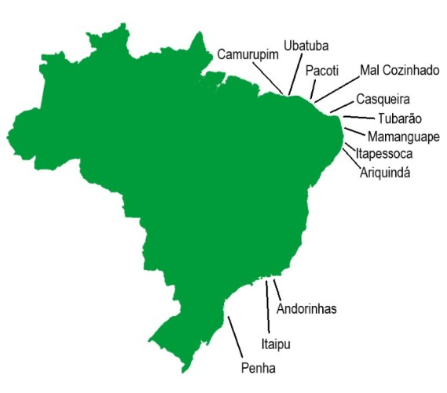
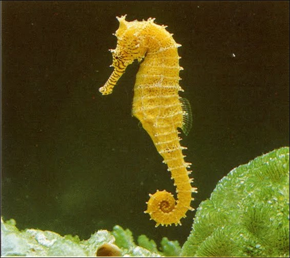

```{r setup, include=FALSE}
knitr::opts_chunk$set(echo = FALSE)
```

```{r, message=FALSE}

library(tidyverse)

```

## **Introduction** {data-background="../images/Camurupim.jpg"}

This presentation shows the size and locations for visible

_Hippocampus reidi_ populations off the coast of Brazil. Its

purpose is to help snorkelers and scuba divers who want to 

view seahorses in the wild. The data will compare the size 

and population trends of the locations.    

## **Locations in Brazil sampled for _Hippocampus reidi_** {data-background="../images/Ubatuba.jpg"}

<div style="float: left; width: 40%;">
- Camurupim         
- Ubatuba             
- Pacoti
- Mal Cozinhado
- Tubarão
- Casqueira
</div>

<div style="float: right; width: 60%;">
- Mamanguape
- Itapessoca
- Ariquindá
- Andorinhas
- Itaipu
- Penha
</div>

The range of _Hippocampus reidi_ is Cape Hatteras, United States 
to Brazil and the Gulf of Mexico

## Map of Seahorse Sample Locations {data-background="../images/Pacoti.jpg"}

<div style= "float:right;position: relative; top: -40px;">



</div>

Within Brazil  

they are 

found from the 

northern state of 

Pará (Salgado 

region) to the 

southern state of 

Rio Grande do 

Sul.


## **How to Find Them** {.smaller data-background="../images/Mal Cozinhado.jpg"}

<div style= "float:right;position: relative; top: -40px;">



</div>

_Hippocampus reidi_ can 

be found down to 55 

meters and can grow 

to approximately 17.5 

centimeters long. They

are found in coral 

reefs and seagrass 

beds.


## **Data for _Hippocampus reidi_ Samples** {.smaller .flexbox .vcenter data-background="../images/Mamanguape.jpg"}

```{r}

Hippocampus_reidi_Brazil <- read.csv("../raw_data/Hippocampus_reidi_Brazil.csv")

data_limited <- select(Hippocampus_reidi_Brazil, Location, Number_Sighted, Avg_Height_cm)

data_limited_1 <- data_limited[-c(7,8,9,10,11,12),]

names(data_limited_1) <- c("Location", "Number Sighted","Average Height (cm)")

knitr::kable(head(data_limited_1))
```

## **More Data for _Hippocampus reidi_** {.smaller .flexbox .vcenter data-background="../images/Casqueira.jpg"}

```{r}

Hippocampus_reidi_Brazil <- read.csv("../raw_data/Hippocampus_reidi_Brazil.csv")

data_limited <- select(Hippocampus_reidi_Brazil, Location, Number_Sighted, Avg_Height_cm)

data_limited_2 <- data_limited[-c(1,2,3,4,5,6),]

names(data_limited_2) <- c("Location", "Number Sighted","Average Height (cm)")

knitr::kable(head(data_limited_2))
 
```

## **Detailed Data for _Hippocampus reidi_** {.smaller .flexbox .vcenter data-background="../images/Tubarao.jpg"}

<div style= "float:left;position: relative; top: +100px;">

Ma = male Fe = female N = non B = brooding I = immature M = mature

Penha removed for small sample size

</div>

<div style= "float:left;position: relative; top: +80px;">

```{r}

data_separated <- select(Hippocampus_reidi_Brazil, Location, Number_Sighted, Avg_Height_cm, Height_Range_cm, Avg_Height_nonbrooding_males_cm, Height_Range_nonbrooding_male_cm, Avg_Height_immature_females_cm, Height_Range_immature_females_cm, Avg_Height_brooding_males_cm, Height_Range_brooding_males_cm, Avg_Height_mature_females_cm, Height_Range_mature_females_cm) 

data = data_separated[-12,]

data_1 = subset(data, select = -c(Number_Sighted,Avg_Height_cm,Avg_Height_nonbrooding_males_cm,Avg_Height_immature_females_cm,Avg_Height_brooding_males_cm,Avg_Height_mature_females_cm) )

data_1 %>%
  separate(Height_Range_cm, into = c("Min cm", "Max cm"), sep = "-") %>%
  separate(Height_Range_nonbrooding_male_cm, into = c("Min NBMa cm", "Max NBMa cm"), sep = "-") %>%
  separate(Height_Range_immature_females_cm, into = c("Min IFe cm", "Max IFe cm"), sep = "-") %>%
  separate(Height_Range_brooding_males_cm, into = c("Min BMa cm", "Max BMa cm"), sep = "-") %>%
  separate(Height_Range_mature_females_cm, into = c("Min MFe cm", "Max MFe cm"), sep = "-") 

```
</div>

## Average Heights by Location {#slide-1.flexbox .vcenter data-background="../images/Itapessoca.jpg"}

<style> 
  #slide-1> p { 
    margin-top: -30px; 
  } 
</style>

```{r}

new_data <- data.frame(data_3 = c("Camurupim","Ubatuba","Pacoti","Mal Cozinhado","Tubarão","Casqueira","Mamanguape","Itapessoca","Ariquindá","Andorinhas","Itaipu"),
Avg_Height_cm = c(12.6,13.83,7.6,6.1,13.5,14.2,13.0,12.8,14.0,9.3,13.9),
Avg_Height_nonbrooding_males_cm = c(14.7,13.0,8.5,3.5,15.0,15.6,13.25,14.5,16.6,12.0,14.7),
Avg_Height_immature_females_cm = c(13.9,15.5,7.8,9.2,15.7,12.8,14.0,14.9,15.2,0,13.9),
Avg_Height_brooding_males_cm = c(14.8,13.0,11.6,11.0,15.9,16.6,14.9,14.7,16.1,12.65,16.0),
Avg_Height_mature_females_cm = c(15.3,16.0,7.1,8.0,16.4,15.5,14.6,14.8,14.1,13.9,13.9))

ggplot(new_data, aes(data_3)) + 
  geom_point(aes(y = Avg_Height_cm, color = "Avg Height (cm)")) + 
  geom_point(aes(y = Avg_Height_nonbrooding_males_cm, color = "Avg Height Nonbrooding Males" )) +
  geom_point(aes(y = Avg_Height_immature_females_cm, color = "Avg Height Immature Females")) +
  geom_point(aes(y = Avg_Height_brooding_males_cm, color = "Avg Height Brooding Males")) +
  geom_point(aes(y = Avg_Height_mature_females_cm, color = "Avg Height Mature Females")) +
   theme_bw() +
  theme(panel.grid.major = element_blank(), panel.grid.minor = element_blank()) +
  xlab("Locations") +
  ylab("Average Heights (cm)") +
  theme(axis.text.x = element_text(angle=90, hjust=1)) 

```

## **Graph of _Hippocampus reidi_ size and visible populations**

```{r}

ggplot(data = data_separated) + 
  geom_point(mapping = aes(x = Number_Sighted, y = Avg_Height_cm, color = Location)) +
  theme_bw() +
  theme(panel.grid.major = element_blank(), panel.grid.minor = element_blank()) +
  xlab("Number Sighted") +
  ylab("Average Height (cm)") 

```


