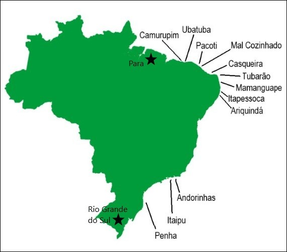

```{r setup, include=FALSE}
knitr::opts_chunk$set(echo = FALSE)
```

```{r, message=FALSE}

library(tidyverse)

```

## **Seahorses**

This presentation shows the size and locations for visible _Hippocampus reidi_ populations off the coast of Brazil. Its purpose is to help snorkelers and scuba divers who want to view seahorses in the wild.  

## **Locations in Brazil to find _Hippocampus reidi_** {.smaller}

- Camurupim         
- Ubatuba             
- Pacoti
- Mal Cozinhado
- Tubarão
- Casqueira
- Mamanguape
- Itapessoca
- Ariquindá
- Andorinhas
- Itaipu
- Penha

## **_Hippocampus reidi_** 


## Map of Seahorse Locations



## **Data for _Hippocampus reidi_** {.smaller .flexbox .vcenter}

```{r raw_data}

Hippocampus_reidi_Brazil <- read.csv("../raw_data/Hippocampus_reidi_Brazil.csv")

knitr::kable(head(Hippocampus_reidi_Brazil))

```

## **Modified data for _Hippocampus reidi_** {.smaller .flexbox .vcenter}

This code separates the average height column into minimum and maximum height columns.


```{r, echo=TRUE}

data_separated <- select(Hippocampus_reidi_Brazil, Location, Number_Sighted, Avg_Height_cm, Height_Range_cm, Avg_Height_nonbrooding_males_cm, Height_Range_nonbrooding_male_cm, Avg_Height_immature_females_cm, Height_Range_immature_females_cm, Avg_Height_brooding_males_cm, Height_Range_brooding_males_cm, Avg_Height_mature_females_cm, Height_Range_mature_females_cm) 

data_separated = data_separated[-12,]

data_separated %>%
  separate(Height_Range_cm, into = c("Minimum_Height_cm", "Maximum_Height_cm"), sep = "-") %>%
  separate(Height_Range_nonbrooding_male_cm, into = c("Minimum_Height_NB_male_cm", "Maximum_Height_NB_male_cm"), sep = "-") %>%
  separate(Height_Range_immature_females_cm, into = c("Minimum_Height_IF_cm", "Maximum_Height_IF_cm"), sep = "-") %>%
  separate(Height_Range_brooding_males_cm, into = c("Minimum_Height_BM_cm", "Maximum_Height_BM_cm"), sep = "-") %>%
  separate(Height_Range_mature_females_cm, into = c("Minimum_Height_MF_cm", "Maximum_Height_MF_cm"), sep = "-") 

knitr::kable(head(Hippocampus_reidi_Brazil))

```

## **Graph of _Hippocampus reidi_ size and visible populations**

```{r}

ggplot(data = data_separated) + 
  geom_point(mapping = aes(x = Number_Sighted, y = Avg_Height_cm, color = Location)) +
  theme_bw() +
  theme(panel.grid.major = element_blank(), panel.grid.minor = element_blank()) +
  xlab("Number Sighted") +
  ylab("Average Height (cm)") 

```


